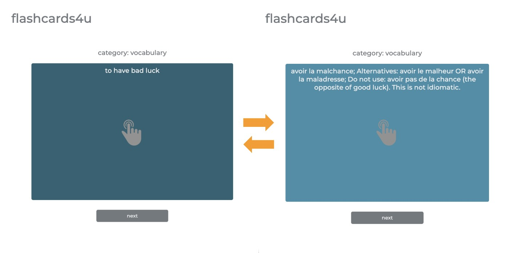

# Flashcards3
[www.flashcards4u.com](http://www.flashcards4u.com) is a test-driven, Java Spring Boot webapp. 
It loads content into digital flashcards for on-the-go studying. Click the card to toggle between front and back.
Click the 'next' button to view the subsequent card.

As of 2026, this app is using content for learning French, but the app is content-agnostic. 
It can be used for any subject.

  

## New Features
* Integration with Generative AI service:
  I am currently working on a feature to allow the user to gain additional context about the topic of a flashcard without leaving the app.

## Development

### Dependencies
* Java 21
* Spring Boot 3.4.0
* Maven 3

### Run
* From command line: `./mvnw spring-boot:run`
* Navigate to `http://localhost:8080/` in browser

### Testing
* Run test suite: `./mvnw test`

### Troubleshooting
* See [springboot4 repo](https://github.com/chrisbrickey/springboot4) for sample code and notes

## Content Sources

### CSV Files

#### Why use CSV files when I could use a database? 

I'm a lifelong learner, taking on a new subject every few years. Flashcards (physical and digital) are a powerful tool for internalizing concepts and accelerating learning.
I built this app for myself and have used it for numerous subjects. 

For me, the creation of the content of a flashcard is just as impactful as the review. It forces me to write out the logic, which crystallizes the learning. 
And, as I learn more about a domain, the flashcards must evolve to capture new understanding of connections and contexts that were not apparent at first.

So the requirement of easy editing across hundreds or thousands of human-readable items is paramount for the primary use case of this app. CSV meets this need well while also providing sufficient structure to the data. 

Traditional databases are more reliable. No doubt. But (for me) the ease of add and edit to a CSV file outweighs the advantages of a more traditional database for this app. 

#### Parsing Particularities

This app parses CSV files on the server and displays the content in a browser as HTML. Both CSV and HTML have different character string constraints. 

This app performs the following mutations (from CSV to HTML) to handle the gap in constraints:
* backtick -> comma